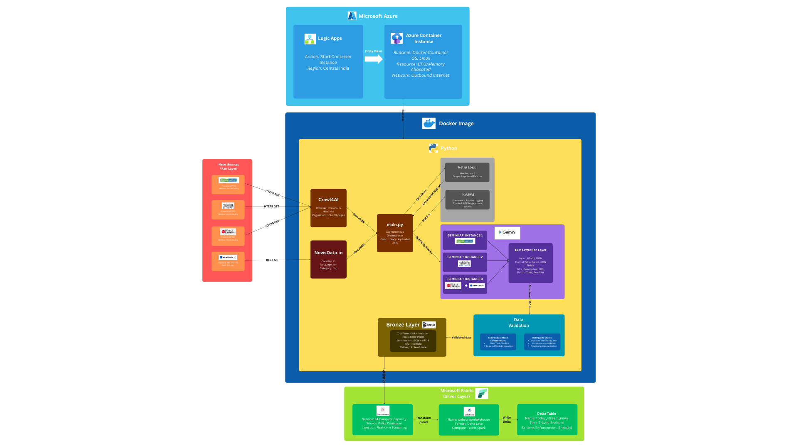

# Automated News Web Scraper with Real-Time Streaming

A web scraping application that automatically extracts news articles from multiple sources and streams them in real-time to Microsoft Fabric Lakehouse using Kafka event streaming.

## Features

- **Asynchronous Web Scraping**: Uses crawl4ai for efficient, paginated content extraction
- **AI-Powered Extraction**: Leverages Google Gemini AI to intelligently parse and structure news data
- **Real-Time Event Streaming**: Streams data via Confluent Kafka to Microsoft Fabric Eventstream
- **Delta Lake Storage**: Automatically ingests into Lakehouse with ACID transactions
- **Duplicate Detection**: Prevents re-scraping of already collected articles
- **Multi-Source Support**: Scrapes from Moneycontrol, The Hindu, Indian Express, and NewsData API
- **Dockerized Deployment**: Runs in Azure Container Instances for serverless execution
- **Automated Scheduling**: Daily execution via Azure Logic Apps

## Prerequisites

- Python 3.12+
- Docker Desktop
- Azure Subscription
- Google Gemini API Keys (3 keys for parallel processing)
- Microsoft Fabric workspace with Eventstream
- Confluent Kafka credentials
- NewsData.io API Key

## Architecture



The pipeline consists of five main layers:
1. **Orchestration Layer**: Azure Logic App triggers daily container execution
2. **Data Extraction Layer**: Python scraper with Crawl4AI and Gemini AI
3. **Data Processing Layer**: Pydantic models for validation and deduplication
4. **Data Streaming Layer**: Kafka producer streams to Fabric Eventstream
5. **Data Storage Layer**: Continuous ingestion into Delta Lake tables

## Project Structure

```
paginated_ai_web_crawler/
├── main.py                 # Main application entry point
├── config.py              # Source configurations (URLs, selectors, API keys)
├── pyproject.toml         # Python dependencies
├── Dockerfile             # Container configuration
├── .dockerignore          # Docker build exclusions
├── env-vars.yaml          # Environment variables template
├── models/
│   └── mcnews.py         # Pydantic data models
└── utils/
    ├── kafka_producer.py  # Kafka streaming utilities
    ├── data_utils.py      # Data utilities
    ├── scraper_utils.py   # Web scraping logic
    └── api_scraper.py     # API integration utilities
```

## Installation

### Local Development

1. **Clone the repository**
   ```bash
   git clone https://github.com/ib105/ai_web_crawler
   cd paginated_ai_web_crawler
   ```

2. **Create virtual environment**
   ```bash
   python -m venv venv
   source venv/bin/activate  # On Windows: venv\Scripts\activate
   ```

3. **Install dependencies**
   ```bash
   pip install -e .
   playwright install chromium
   ```

4. **Configure environment variables**
   
   Create a `.env` file:
   ```env
   GEMINI_API_KEY_1=your_gemini_api_key_1
   GEMINI_API_KEY_2=your_gemini_api_key_2
   GEMINI_API_KEY_3=your_gemini_api_key_3
   NEWSDATA_API_KEY=your_newsdata_api_key
   KAFKA_BOOTSTRAP_SERVERS=your_eventstream_endpoint
   KAFKA_USERNAME=your_kafka_username
   KAFKA_PASSWORD=your_kafka_password
   KAFKA_TOPIC=news-events
   ```

5. **Run locally**
   ```bash
   python main.py
   ```

## Docker Deployment

### Build and Test Locally

```bash
docker build -t news-scraper:latest .

docker run --env-file .env news-scraper:latest
```

### Deploy to Azure

1. **Create Azure Container Registry**
   ```bash
   az acr create \
     --resource-group Fabric \
     --name webnewsscraper \
     --sku Basic \
     --location centralindia
   ```

2. **Build and push image**
   ```bash
   az acr login --name webnewsscraper
   
   docker build -t webnewsscraper.azurecr.io/news-scraper:latest .
   docker push webnewsscraper.azurecr.io/news-scraper:latest
   ```

3. **Test container deployment**
   ```bash
   az container create \
     --resource-group Fabric \
     --name news-scraper-test \
     --image webnewsscraper.azurecr.io/news-scraper:latest \
     --registry-login-server webnewsscraper.azurecr.io \
     --registry-username webnewsscraper \
     --registry-password "<your-password>" \
     --cpu 1 \
     --memory 2 \
     --restart-policy Never \
     --location centralindia \
     --os-type Linux \
     --environment-variables @env-vars.yaml
   ```

## Automated Scheduling

### Azure Logic App Setup

1. **Create Logic App** in Azure Portal
2. **Add Recurrence Trigger**:
   - Frequency: Daily
   - Time: 9:00 AM IST
3. **Add Container Instance Action**:
   - Action: "Create or update a container group"
   - Configure with your ACR image and environment variables
4. **Save and enable** the Logic App

The scraper will now run automatically every day at 9:00 AM.

## Microsoft Fabric Integration

### Eventstream Setup

1. **Create Eventstream** in Fabric workspace
2. **Add Custom Endpoint Source**:
   - Protocol: Kafka
   - Authentication: SASL_SSL
   - Note the connection details for your application
3. **Add Lakehouse Destination**:
   - Target: Your Fabric Lakehouse
   - Table: stream_news
   - Mode: Append (continuous ingestion)
4. **Configure Event Processing** (optional):
   - Add transformations if needed
   - Set up event filtering
5. **Start the Eventstream**

## Kafka Configuration

The application uses Confluent Kafka client with the following settings:

- **Protocol**: SASL_SSL
- **SASL Mechanism**: PLAIN
- **Compression**: gzip
- **Delivery Guarantee**: At-least-once
- **Idempotence**: Enabled

Messages are sent page-by-page with automatic retry logic for failed deliveries.

## Resources

- [crawl4ai Documentation](https://docs.crawl4ai.com/)
- [Azure Container Instances](https://docs.microsoft.com/azure/container-instances/)
- [Microsoft Fabric Eventstream](https://learn.microsoft.com/fabric/real-time-analytics/event-streams/)
- [Confluent Kafka Python](https://docs.confluent.io/kafka-clients/python/current/overview.html)
- [Delta Lake](https://delta.io/)
- [Playwright Documentation](https://playwright.dev/python/)

---

**Last Updated**: December 2025
